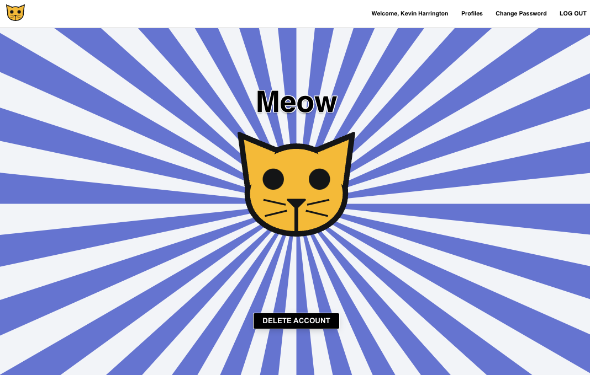

# Meow

## [OPEN SITE HERE](https://viagggi.netlify.app/)

### Welcome to Meow! This is a rep of the Meow Meow Beans code-along created and presented by Hunter Long and David Stinson.  The name has been changed to Meow to prevent confusion.  Meow is based on a popular episode of Community where Greendale Community College test out an app where you can vote one to five meow meow beans on the people around you.  The app allows you to vote on others and others can vote on you.  It also allows you to delete your account, which everyone did at the end of the show when things fell into a dystopian society.
 
### Contributors:

- Hunter Long
- David Stinson
- [Kevin Harrington](https://github.com/kevinharr)

#### Technologies Used 💻
- React
- Node.js
- Express
- PostgreSQL
- Fly.io
- Netlify
- Sequelize
- JavaScript
- HTML 
- CSS

#### Resources 💾
- Graphics created by Hunter Long.

